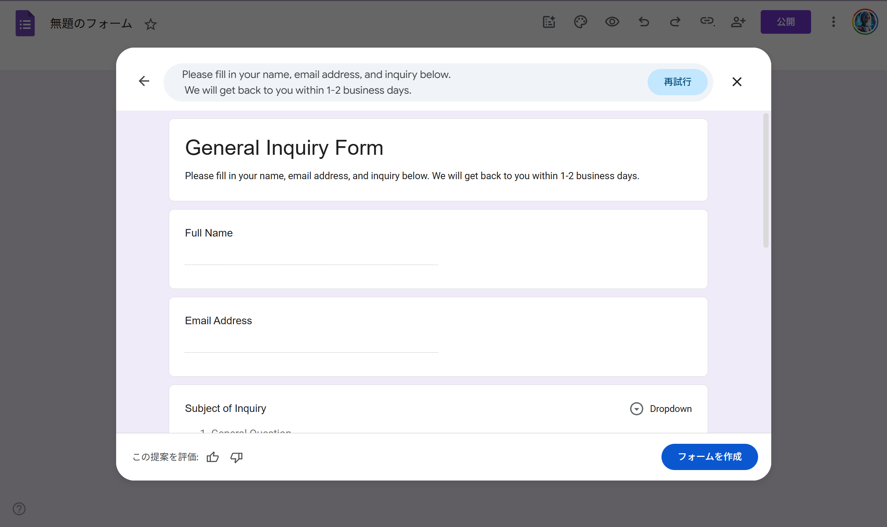
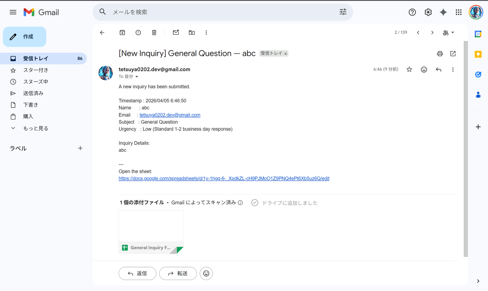
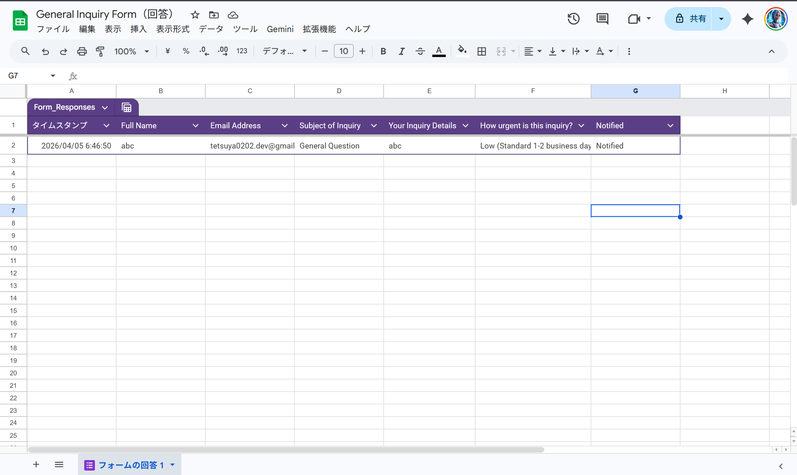

# 02: Form → Sheet → Email Notification

Automates inquiry management using Google Forms, Sheets, and Gmail — all without any external services.

## What It Does

1. Visitor submits the **Google Form**
2. Response is **logged to Google Sheets** automatically
3. **Admin receives an email** with all inquiry details + a link to the sheet
4. **Submitter receives a confirmation** email instantly
5. Row is marked **"Notified"** in the sheet for easy tracking

## Screenshots

### Form (public URL)


### Admin Notification Email


### Spreadsheet with Status Column


## Setup

### 1. Create the Google Form

Add the following fields:
| Field | Type |
|-------|------|
| Full Name | Short answer |
| Email Address | Short answer |
| Subject of Inquiry | Dropdown |
| Your Inquiry Details | Paragraph |
| How urgent is this inquiry? | Multiple choice |

### 2. Link Form to Spreadsheet

Form editor → **Responses** tab → Spreadsheet icon → Create new spreadsheet

### 3. Configure the Script

Open `form_notify.js` and set:

```js
var SPREADSHEET_ID = "your-spreadsheet-id-here";
```

The spreadsheet ID is found in the spreadsheet URL:
`https://docs.google.com/spreadsheets/d/【ID】/edit`

### 4. Deploy with clasp

```bash
clasp create --type standalone --title "02 Form to Sheet Notify"
clasp push --force
```

### 5. Run `setupTrigger()` Once

Open the GAS editor → select `setupTrigger` from the dropdown → click **Run**  
Approve the permission dialog when prompted.

### 6. Test

Run `testNotification()` from the editor — you should receive 2 emails.

## File Structure

```
02_form-to-sheet-notify/
├── form_notify.js     # Main script
├── appsscript.json    # GAS manifest
├── img/
│   ├── form.png
│   ├── email.png
│   └── sheet.png
└── README.md
```

## Key Functions

| Function | Description |
|----------|-------------|
| `onFormSubmit(e)` | Triggered on form submission |
| `sendAdminNotification()` | Sends inquiry details to admin |
| `sendAutoReply()` | Sends confirmation to submitter |
| `setupTrigger()` | Registers the form-submit trigger (run once) |
| `testNotification()` | Manual test without a real submission |
