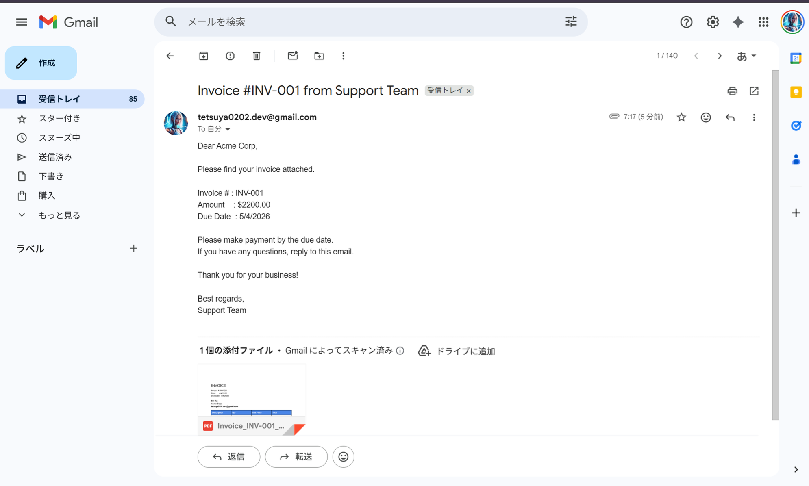
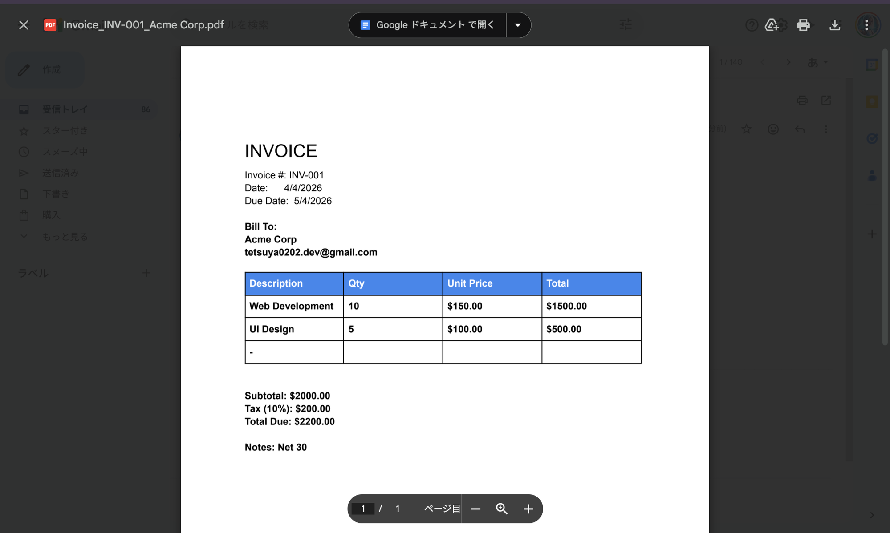
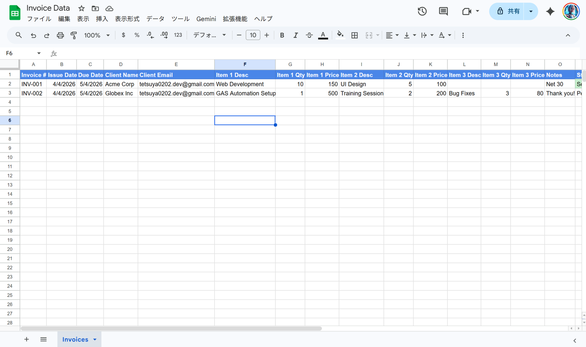

# 03: Invoice Generator

Automatically generates professional PDF invoices from a Google Sheets data file,
saves them to Google Drive, and emails them to clients — all with Google Apps Script.

## What It Does

1. Read invoice data from **Google Sheets**
2. Copy a **Google Docs template** and replace all placeholders
3. Export the filled document as a **PDF**
4. Save the PDF to a **Google Drive folder**
5. **Email the PDF** to the client with invoice details
6. Mark the row as **"Sent"** (highlighted green) in the spreadsheet

## Screenshots

### Invoice Email (with PDF attachment)


### Generated PDF Invoice


### Spreadsheet — Status Updated to "Sent"


## Setup

### 1. Run `createTemplateAndSheet()`

This one-time setup function automatically creates:
- A Google Docs invoice template (with placeholders)
- A Google Sheets data file (with sample invoices)
- A Google Drive folder for PDF output

It will log 3 IDs to the execution log — copy them into the script constants.

### 2. Set the IDs in `invoice_generator.js`

```js
var TEMPLATE_DOC_ID  = "your-docs-template-id";
var SPREADSHEET_ID   = "your-spreadsheet-id";
var OUTPUT_FOLDER_ID = "your-drive-folder-id";
```

### 3. Deploy with clasp

```bash
clasp create --type standalone --title "03 Invoice Generator"
clasp push --force
```

### 4. Generate Invoices

- **Single invoice**: Run `testSingleInvoice()` (processes row 2)
- **All pending**: Run `generateAllPendingInvoices()` (processes all rows with status "Pending")

## Spreadsheet Format

| Column | Field |
|--------|-------|
| A | Invoice # |
| B | Issue Date |
| C | Due Date |
| D | Client Name |
| E | Client Email |
| F–H | Item 1 (Description, Qty, Price) |
| I–K | Item 2 (Description, Qty, Price) |
| L–N | Item 3 (Description, Qty, Price) |
| O | Notes |
| P | Status (`Pending` → `Sent`) |

## Template Placeholders

| Placeholder | Value |
|-------------|-------|
| `{{invoice_number}}` | Invoice # |
| `{{issue_date}}` | Issue date |
| `{{due_date}}` | Due date |
| `{{client_name}}` | Client name |
| `{{client_email}}` | Client email |
| `{{item1_desc}}` ~ `{{item3_total}}` | Line item fields |
| `{{subtotal}}` | Sum before tax |
| `{{tax}}` | 10% tax |
| `{{total}}` | Total due |
| `{{notes}}` | Notes |

## File Structure

```
03_invoice-generator/
├── invoice_generator.js   # Main script
├── appsscript.json        # GAS manifest
├── img/
│   ├── email.png
│   ├── invoice_pdf.png
│   └── sheet.png
└── README.md
```

## Key Functions

| Function | Description |
|----------|-------------|
| `createTemplateAndSheet()` | One-time setup — creates Docs/Sheets/Drive resources |
| `generateAllPendingInvoices()` | Process all rows with status "Pending" |
| `generateInvoice(row)` | Generate PDF for a specific row number |
| `testSingleInvoice()` | Test with row 2 |
