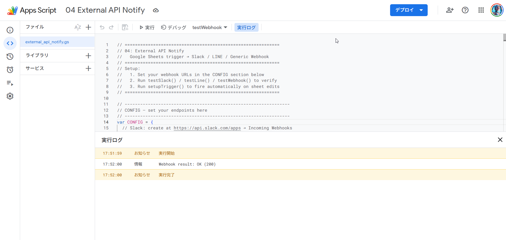
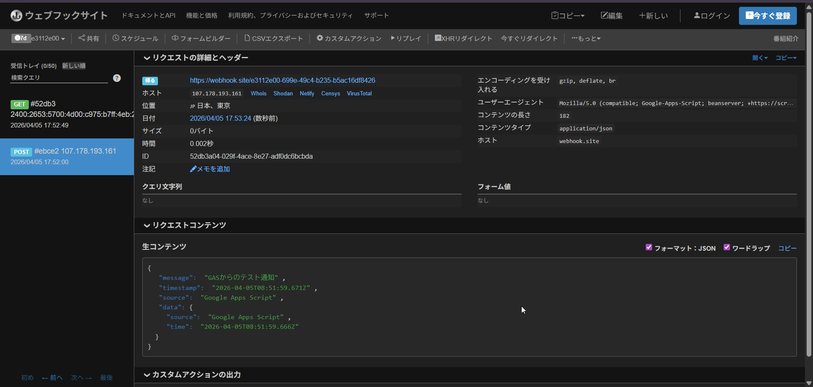

# 04: External API Notify

Send real-time notifications from Google Sheets to **Slack**, **LINE**, and any **Webhook** endpoint (Zapier, Make, n8n, etc.) using Google Apps Script.

## What It Does

1. A row is added or updated in **Google Sheets**
2. GAS fires and sends notifications to all configured channels:
   - **Slack** — rich message with attachment fields
   - **LINE Notify** — instant mobile push notification
   - **Generic Webhook** — JSON POST to any endpoint
3. Row is marked **"Sent"** (green) in the spreadsheet

## Screenshots

### GAS Execution Log


### Webhook Request Received (webhook.site)


## Supported Integrations

| Service | Method | Use Case |
|---------|--------|----------|
| Slack | Incoming Webhook | Team alerts, ops notifications |
| LINE Notify | REST API + Bearer token | Mobile push to individuals/groups |
| Generic Webhook | HTTP POST (JSON) | Zapier, Make, n8n, custom APIs |

## Setup

### 1. Configure endpoints in `external_api_notify.js`

```js
var CONFIG = {
  slack_webhook_url: "https://hooks.slack.com/services/xxx/yyy/zzz",
  line_notify_token: "your-line-notify-token",
  generic_webhook_url: "https://webhook.site/your-unique-id",
  spreadsheet_id: "your-spreadsheet-id",
  sheet_name: "Notifications"
};
```

**How to get each credential:**
- **Slack**: [api.slack.com/apps](https://api.slack.com/apps) → Create App → Incoming Webhooks → Activate → Add to Workspace
- **LINE Notify**: [notify-bot.line.me/my](https://notify-bot.line.me/my/) → Generate token
- **Webhook**: Use [webhook.site](https://webhook.site) for testing, or your own endpoint

### 2. Deploy with clasp

```bash
clasp create --type standalone --title "04 External API Notify"
clasp push --force
```

### 3. Create the notification spreadsheet

Run `setupSampleSheet()` from the GAS editor — it creates a spreadsheet and logs its ID. Set that ID in `CONFIG.spreadsheet_id`.

### 4. Register the trigger

Run `setupTrigger()` once to activate the onEdit trigger.

### 5. Test each channel

```
testWebhook()  → sends to generic webhook endpoint
testSlack()    → sends to Slack channel
testLine()     → sends to LINE Notify
testAll()      → sends to all configured channels
```

## Spreadsheet Format

| Column | Field |
|--------|-------|
| A | Type (e.g. "Alert", "Order") |
| B | Title |
| C | Detail |
| D | Amount |
| E | Status (`Pending` → `Sent`) |

## File Structure

```
04_external-api-notify/
├── external_api_notify.js   # Main script
├── appsscript.json          # GAS manifest
├── img/
│   └── webhook.png
└── README.md
```

## Key Functions

| Function | Description |
|----------|-------------|
| `notifyAll(message, data)` | Send to all configured channels |
| `sendSlack(message, data)` | Slack Incoming Webhook |
| `sendLine(message)` | LINE Notify API |
| `sendGenericWebhook(message, data)` | HTTP POST to any endpoint |
| `setupTrigger()` | Register onEdit trigger (run once) |
| `setupSampleSheet()` | Create sample spreadsheet |
| `testAll()` | Test all channels at once |
